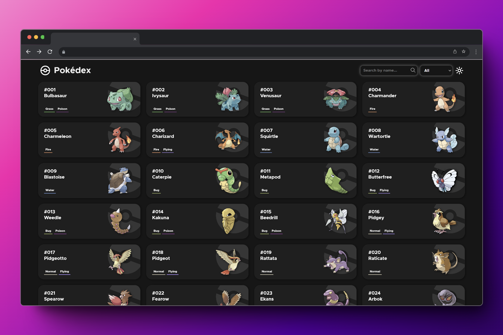

# Pokedex App

This is a simple **Pokedex application built using React**. It utilizes the PokeAPI to fetch and display information about Pokémon, providing features like displaying Pokémon, loading more Pokémon, searching, and more. Additionally, the app offers both dark and light modes for user preference.



## Features

- **Display Pokémon:** View a list of Pokémon with their basic information.
- **Load More Pokémon:** Load additional Pokémon as the user scrolls down the list.
- **Search:** Search for specific Pokémon by name.
- **Filter by Types:** Filter Pokémon by their types (e.g., fire, water, grass).
- **View Statistics:** Access detailed statistics of Pokémon.
- **Dark/Light Mode:** Switch between dark and light themes for comfortable viewing.


## Technologies Used

<div align="center">


</div>

For this project, I've used JavaScript to handle most of the coding stuff. CSS modules made styling in React easier, keeping things organized. And with React, I've played around with state management and hooks like useEffect and custom hooks to make things more interactive and smooth.

## Usage

1. Clone the repository:

   ```
   git clone https://github.com/your-username/pokedex.git
   ```

2. Navigate into the project directory:

   ```
   cd pokedex
   ```

3. Install dependencies:

   ```
   npm install
   ```

4. Start the development server:

   ```
   npm run dev
   ```

5. Open the application in your browser:

   ```
   http://localhost:5173
   ```

## Contributing

Contributions are welcome! If you'd like to contribute to this project, please follow these steps:

1. Fork the repository.
2. Create a new branch (`git checkout -b feature/your-feature`).
3. Make your changes.
4. Commit your changes (`git commit -am 'Add some feature'`).
5. Push to the branch (`git push origin feature/your-feature`).
6. Create a new Pull Request.

## Credits

This project was created by Gerard Doncel.

Special thanks to the [PokeAPI](https://pokeapi.co/) for providing Pokémon data.